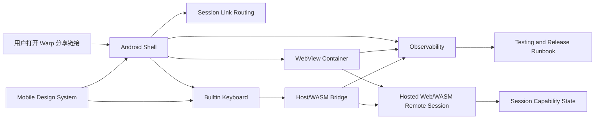

# Android WebView Remote Control Docs

本目录把“将 Web 远控分享链接封装成 Android 移动应用，并复用 Astropath 内置键盘设计”的产品、技术和模块开发文档落地。

## 文档索引

- [PRODUCT.md](PRODUCT.md): 用户目标、范围、核心体验、验收标准。
- [TECH.md](TECH.md): 当前代码依据、架构方案、跨端边界、阶段计划。
- [PROJECT_LOG.md](PROJECT_LOG.md): 实施检查点、验证结果、操作经验。

## 模块文档

以下 10 个模块是后续实现和验收的 canonical 文档入口：

- [modules/01-android-shell.md](modules/01-android-shell.md): Android 原生壳、Activity、导航、生命周期、错误恢复。
- [modules/02-webview-container.md](modules/02-webview-container.md): WebView 容器、安全配置、页面加载策略、测试假页。
- [modules/03-session-link-routing.md](modules/03-session-link-routing.md): 分享链接识别、解析、跳转、脱敏和最近会话。
- [modules/04-host-wasm-bridge.md](modules/04-host-wasm-bridge.md): Android 原生层、WebView JS、WASM/Rust 之间的事件桥。
- [modules/05-builtin-keyboard.md](modules/05-builtin-keyboard.md): 复用 Astropath 设计的内置终端键盘。
- [modules/06-session-capability-state.md](modules/06-session-capability-state.md): 会话角色、输入权限、断线和重连状态。
- [modules/07-observability.md](modules/07-observability.md): 日志、指标、诊断包和隐私脱敏。
- [modules/08-testing-validation.md](modules/08-testing-validation.md): 单测、Instrumentation、Web/WASM、真实设备冒烟。
- [modules/09-release-runbook.md](modules/09-release-runbook.md): 构建、安装、启动、logcat、调试和发布前操作手册。
- [modules/10-mobile-design-system.md](modules/10-mobile-design-system.md): Android/iOS native 视觉一致性、Warp token 复用、组件映射和防分叉规则。首个实现入口是 `crates/mobile_design_tokens`。

## 总体切分

## 开发顺序

1. 链接路由和 Android 壳先落地，保证用户能稳定打开同一个远控分享链接。
2. WebView 容器和 Host/WASM Bridge 并行设计，但先只开放最小事件集。
3. 内置键盘以 Astropath 的交互模型为准，先做输入正确性，再做细节体验。
4. 会话权限、日志、测试脚手架贯穿每个阶段，不作为最后补丁。
5. Release runbook 随真实命令、日志 tag、包名和设备验证流程持续更新。
6. Android/iOS native 视觉只能从 Warp token 和组件映射派生，不能各端重新设计。
