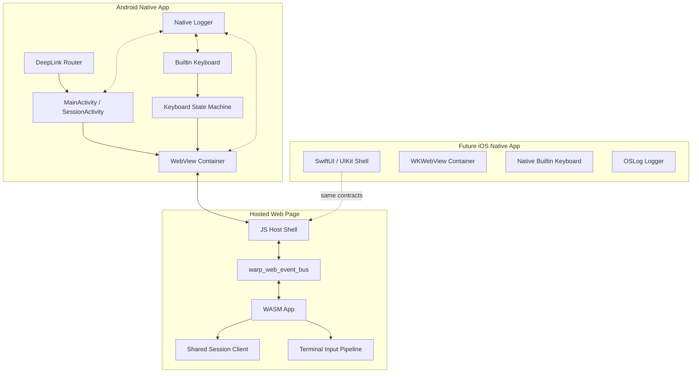

# Android WebView Remote Control Technical Plan

## 当前代码依据

- `crates/serve-wasm/src/main.rs` 已有 `/session/{session_id}` Web 路由，可作为移动端分享链接的目标页面。
- `app/src/uri/web_intent_parser.rs` 已有 session 链接解析、UUID 校验、query 保留、`shared_session` intent 重写和 desktop open 逻辑。
- `app/src/terminal/shared_session/mod.rs` 已有 shared session 状态、join link、native intent 和 executor role 判断。
- `crates/warp_web_event_bus/src/lib.rs` 已有 WASM 到宿主页面的事件通道，包括 `SessionJoined`、`LoggedOut`、`OpenOnNative`。
- `crates/warpui/src/platform/wasm/hidden_input.rs`、`soft_keyboard.rs` 和 `windowing/winit/event_loop/mod.rs` 已有 Web/WASM 软键盘输入、hidden input 和 visual viewport resize 处理。
- `app/Cargo.toml` 中已有 `viewing_shared_sessions`、`hoa_remote_control`、`remote_tty` 等相关 feature flags，可作为能力上线和隔离的参考。

## 架构原则

1. Android 是远控 Web 的移动宿主，不是第二套远控协议客户端。
2. iOS 后续采用同样边界：native shell 承担平台能力，Web/WASM 远控核心共享。
3. Web/WASM 仍负责远控页面渲染、会话连接和终端主体交互。
4. Android/iOS 原生层负责移动平台能力：链接接管、WebView/WKWebView 生命周期、安全外壳、内置键盘、原生日志入口。
5. 键盘动作使用平台无关的 terminal action 模型，不让 Android 或 iOS 直接拼接 DOM KeyboardEvent。
6. 会话权限由 Web/WASM 暴露给 native shell，native shell 只按状态启用或禁用输入。
7. Native 视觉从 Warp web/desktop 的 token 和组件语义派生，不允许 Android/iOS 各自重新定义视觉系统。

## 目标架构



## 模块边界

### Session Link Routing

职责是把外部 URL 解析为移动端 session launch request。它保留现有 Web query 参数，规范化 session id，生成 WebView load URL 和日志脱敏字段。

### Android Shell

职责是 Android Activity、Intent、生命周期、屏幕方向、沉浸式窗口、返回栈、错误页和恢复动作。它不理解终端协议。

### WebView Container

职责是 WebView 初始化、安全策略、allowlist、cookie/storage 策略、页面加载状态、WebChrome/WebViewClient、JS bridge 注册和销毁。

### Host/WASM Bridge

职责是 Android 和 Web/WASM 的双向事件协议。现有 `warpEmitEvent` 继续承担 Web 到宿主方向；新增宿主到 Web/WASM 的 terminal action 入口。

### Builtin Keyboard

职责是原生键盘 UI、按键布局、修饰键状态、长按重复、反馈、键盘模式切换和动作生成。键盘不直接判断远程会话协议。

### Session Capability State

职责是把 Web/WASM 的连接状态、角色和输入能力映射给 Android。Android 根据这些状态启用、禁用或缓冲输入。

### Observability

职责是日志 schema、指标、bridge 事件序列、输入路径追踪、WebView 诊断和隐私脱敏。

### Testing and Validation

职责是单元测试、Android instrumentation、WASM bridge 测试、真实设备冒烟和失败定位。

### Release Runbook

职责是打包、安装、App Link 启动、logcat、诊断导出、发布前检查和操作经验沉淀。

### Mobile Design System

职责是把 Warp web/desktop 的主题 token、按钮语义、弹窗、tooltip、快捷键、inline banner、图标和字体层级映射到 Android Compose 与未来 iOS SwiftUI/UIKit，防止两端 native UI 分叉。

## Bridge 协议草案

### Android 到 Web/WASM

```json
{
  "kind": "TERMINAL_ACTION",
  "version": 1,
  "sequenceId": "android-keyboard-000001",
  "source": "android_builtin_keyboard",
  "action": {
    "type": "sendModifiedKey",
    "key": "c",
    "modifiers": ["ctrl"]
  }
}
```

动作类型：

- `sendPrintable`: 普通可打印字符。
- `sendRaw`: Esc、Tab、Enter、Backspace、Delete 等原始控制输入。
- `sendModifiedKey`: Ctrl、Alt、Shift 组合。
- `sendNavigation`: Arrow、Home、End、PageUp、PageDown。

### Web/WASM 到 Android

```json
{
  "kind": "SESSION_INPUT_CAPABILITY_CHANGED",
  "version": 1,
  "sequenceId": "wasm-session-000042",
  "session": {
    "sessionIdHash": "sha256:...",
    "status": "active_viewer",
    "role": "executor",
    "canSendInput": true
  }
}
```

Web/WASM 侧还应发送：

- `SESSION_JOINED`
- `SESSION_DISCONNECTED`
- `SESSION_ENDED`
- `AUTH_REQUIRED`
- `OPEN_ON_NATIVE_REQUESTED`
- `TERMINAL_ACTION_ACK`
- `TERMINAL_ACTION_REJECTED`

## 键盘复用 Astropath 的方式

Astropath 是 Flutter 实现，Warp Android 可以用 Kotlin/Compose 或现有 Android UI 技术重建同一交互合同。复用重点是设计和行为模型，而不是跨技术栈复制 widget 代码。

需要保留的设计合同：

- `systemIme` 和 `builtin` 两种键盘模式。
- `leftPeek`、`center`、`rightPeek` 三个锚点和拖拽吸附。
- 中心主键区加左右窥视区，而不是普通聊天输入框。
- `ctrl`、`alt`、`shift` 三个修饰键，每个都有 inactive、one-shot、locked 三态。
- `ActionDispatcher` 统一把 UI 按键转成 terminal action。
- `RepeatPressController` 处理 Backspace、Delete、方向键等重复输入。
- `KeyboardFeedback` 负责触觉和按键音偏好。
- 发送失败或会话未 ready 时进入有上限的短缓冲，并有日志。

## 阶段计划

### M0 文档和架构对齐

- 本目录所有模块文档落地。
- 明确第一阶段只封装 Web 远控分享链接。
- 明确 Astropath 键盘的可复用行为合同。

退出标准：产品、技术、模块、测试、日志和运行手册都有可执行文档。

### M1 Android 壳和链接打开

- 新增 Android 应用入口和 session intent 解析。
- 打开分享链接后加载 WebView。
- WebView allowlist、错误页、重试、外部浏览器打开。

退出标准：真实设备可从外部分享链接进入远控页面。

### M2 Bridge 和会话状态

- 打通 Web 到 Android 的 session 状态事件。
- 打通 Android 到 Web/WASM 的 terminal action。
- 增加 ack/reject 和序列号日志。

退出标准：无键盘 UI 时，也能用测试入口发送 terminal action 并收到确认或拒绝。

### M3 内置键盘

- 实现三段键盘、拖拽锚点、修饰键、重复按压、反馈、系统输入法切换。
- 接入 M2 bridge。
- 按会话输入能力启用或禁用按键。

退出标准：真实设备完成常用 shell 输入、Ctrl+C 中断、方向键历史导航、长按删除。

### M4 测试、日志和发布准备

- 完成 Android instrumentation、WASM bridge 单测、真实设备冒烟脚本和日志 runbook。
- 补齐崩溃、WebView 错误、bridge 超时和输入拒绝诊断。

退出标准：发布前检查可以稳定复现并定位失败原因。

## 主要风险

- WebView 内隐藏输入框和 Android 原生键盘同时争夺焦点。
- JS bridge 如果缺少 origin gate，会扩大 WebView 攻击面。
- Viewer-only 和 executor 角色如果传递不及时，可能导致键盘状态误导。
- 原生键盘到 WASM 输入路径如果绕开现有 terminal pipeline，会制造桌面/Web/移动分叉。
- 远控页面 viewport resize 与原生键盘高度可能重复补偿，造成终端底部遮挡。

## 决策记录

- 第一阶段采用 Android WebView 容器，不重写远控客户端。
- 长期采用 Android/iOS native shell per platform，不用跨端框架隐藏 WebView、IME、link、日志和安全边界。
- 第一阶段复用 Astropath 键盘行为设计，不直接迁移 Flutter 代码。
- 键盘视觉不复用 Astropath 外观，必须映射 Warp token 和组件语义。
- Keyboard action 是跨层协议边界，不能以 UI 文本或 DOM KeyboardEvent 作为长期接口。
- 日志和测试作为每个模块的完成条件，不放到末尾补做。
- Design tokens 是跨平台视觉源头。平台 native 实现只能消费 token 和组件规范，不能新建 feature-specific 视觉变体。
