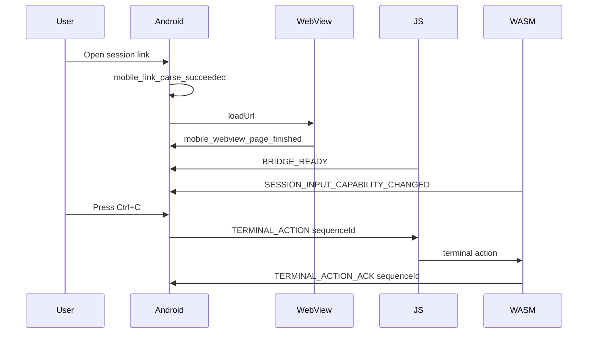

# Module 07: Observability

## 模块目标

为移动远控建立可定位问题的日志、指标和诊断基建。重点覆盖链接打开、WebView 加载、bridge 消息、键盘输入、会话权限和恢复动作。

## 日志原则

- 每个跨模块事件都有 sequence id 或 session id hash。
- 不记录完整分享链接、token、cookie、用户输入明文。
- 错误日志必须包含可行动的 failure reason。
- 输入日志记录动作类型、key code、长度或 hex 摘要，不记录命令文本。
- Android、JS、WASM 的同一 bridge 消息使用同一个 sequence id。

## 核心事件流

## 日志分类

### Link

- `mobile_link_open_received`
- `mobile_link_parse_succeeded`
- `mobile_link_parse_failed`

### Shell

- `mobile_shell_state_changed`
- `mobile_shell_back_pressed`
- `mobile_shell_recover_action_clicked`

### WebView

- `mobile_webview_load_started`
- `mobile_webview_page_finished`
- `mobile_webview_http_error`
- `mobile_webview_renderer_gone`

### Bridge

- `mobile_bridge_message_sent`
- `mobile_bridge_message_received`
- `mobile_bridge_message_ack`
- `mobile_bridge_message_rejected`
- `mobile_bridge_message_timeout`

### Keyboard

- `mobile_keyboard_key_pressed`
- `mobile_keyboard_modifier_changed`
- `mobile_keyboard_action_dispatched`
- `mobile_keyboard_action_buffered`
- `mobile_keyboard_action_dropped`

### Session

- `mobile_session_capability_received`
- `mobile_session_input_enabled`
- `mobile_session_input_disabled`
- `mobile_session_role_changed`

## 指标

- link parse success rate。
- WebView load time。
- bridge ready time。
- session joined time。
- terminal action ack latency。
- terminal action reject rate。
- keyboard buffered action count。
- WebView renderer crash count。

## 诊断包

Debug build 可提供“复制诊断信息”动作，内容包括：

- app version
- build variant
- WebView package version
- Android SDK version
- session id hash
- last 100 mobile remote events
- bridge ready state
- latest input capability

不得包含：

- 完整 URL
- token
- cookie
- 用户输入明文
- 页面 HTML

## 测试

- 日志 schema snapshot。
- 脱敏测试：输入完整 URL 后日志不包含 query value。
- bridge sequence id 端到端测试。
- WebView error 日志包含 failure reason。
- 键盘输入日志不包含 printable 明文。

## 退出标准

- 任一输入丢失问题可定位到 Android key press、bridge send、WASM receive、ack/reject 中的某一段。
- 任一链接打开失败可定位到解析、allowlist、网络、HTTP、SSL 或 renderer crash。
- 诊断包可安全给用户或 issue 附件使用。
